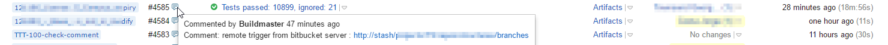
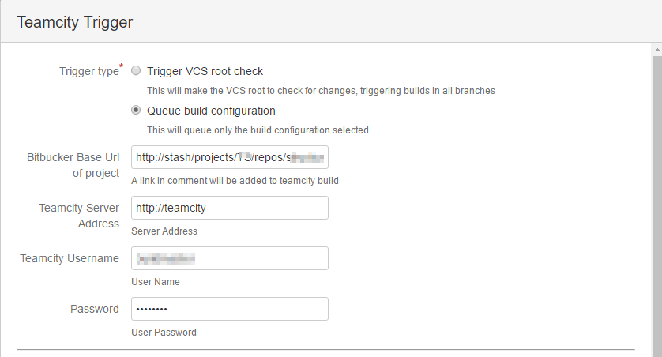

# Bitbucket Server Hook to trigger Teamcity builds

Req: Min Teamcity 8.x, BitbucketServer 4.x
Download last release from: https://github.com/TrimbleSolutionsCorporation/TeamcityTriggerHook/releases

# Features
   The plugin works in 2 different ways, the default will request a VCS root to check for changes. In this case, all build configurations that use the VCS root will be triggered. 
   The second method provides more control and it will trigger only the selected build configurations and selected branch.

# VCS trigger configuration 
   This is default configuration, and its the recommended Teamcityy configuration. However it will cause more builds to trigger, if you are doing feature branch flow in bitbucket.

## Teamcity Configuration
   Create a vcs root and set the checking interval to a random high value to improve performance
   Enable a VCS trigger
   Save the VCS root id to be use in bitbucket configuration

## Bitbucket configuration
   enable hook and set server, username and password
   set one of the VCS roots to the value retrieved in previous section

# Build configuration trigger
  This mode provides more control over what gets triggered in Teamcity, for example currently Teamcity suffers from https://youtrack.jetbrains.com/issue/TW-22830 and https://youtrack.jetbrains.com/issue/TW-33533. That in our case was causing branches without commits to trigger, causing high queues in Teamcity. 
  This mode is supose to handle this, and only build configurations and selected branches are build. Additional to this, a link to bitbucket will be added in Teamcity.

## Teamcity Configuration
  Ensure the VCS root branch definitions are defined as follow:

     +:refs/heads/feature/(*)
     +:refs/heads/bugfix/(*)

  When hook triggers, only the last element after "/" will be sent to teamcity. So if a feature branch is created with
     feature/featute-a then it will trigger feature-a in teamcity configuration

  Also make sure no triggers are defined in the buildconfiguration you want to remote trigger.

## Bitbucket configuration
  Enable the hook and set the following properties

  . Trigger type -> Queue build configuration
  . Bitbucket base url of project -> project url
  . Build configurations -> use teamcity build configurations for the your branch strategy

# Debug
  Check the catalina log for logs error messages like:

    [TeamcityTriggerHook] Trigger builds for branch: feature-a
    [TeamcityTriggerHook] Trigger BuildId: BuildConfigId
    [TeamcityTriggerHook] Trigger BuildId: BuildConfigId2

# Old Stash Version
Please use 1.0-SNAPSHOT 
https://github.com/jmecosta/TeamcityTriggerHook/releases/download/1.0/TeamcityTriggerHook-1.0-SNAPSHOT.jar
